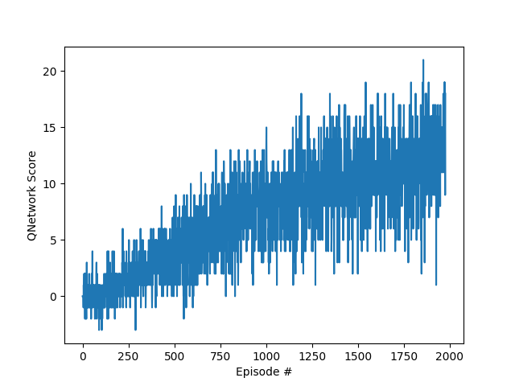
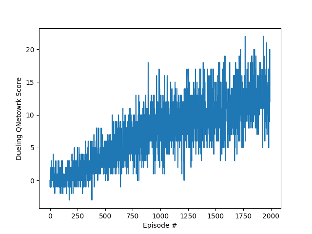

## Learning Algorithm
Two DQN algorithms were implemented and trained.

Originally, DQN is a game image input, but here we learned the game state vector from Unity Agent as input.

The layers and parameters used are shown below.

- Fully connected layer - input: 37 (state size) output: 128
- Fully connected layer - input: 128 output 64
- Fully connected layer - input: 64 output: (action size)

- Maximum steps per episode: 1000
- Starting epsilion: 1.0
- Ending epsilion: 0.01
- Epsilion decay rate: 0.999

### Deep Q Network

- Fully-connected layer - input: 37 (state size) output: 128
- Fully-connected layer - input: 128 output 64
- Fully-connected layer - input: 64 output: (action size)

- Maximum steps per episode: 1000
- Starting epsilion: 1.0
- Ending epsilion: 0.01
- Epsilion decay rate: 0.999


### Dueling Deep Q Network

- Fully-connected layer - input: 37 (state size) output: 128

- Fully-connected layer
    - input: 128 output 64 for approximation state-dependent action advantage function
    - input: 128 output 64 for approximation state value function
- Fully-connected layer
    - input: 64 output: (action size)  for approximation state-dependent action advantage function
    - input: 64 output: 1  for approximation state value function

- Maximum steps per episode: 1000
- Starting epsilion: 1.0
- Ending epsilion: 0.01
- Epsilion decay rate: 0.999


## Plot of Rewards
### Basic DQN



```
Episode 100	Average Score: 0.18
Episode 200	Average Score: 0.50
Episode 300	Average Score: 1.42
Episode 400	Average Score: 2.33
Episode 500	Average Score: 3.19
Episode 600	Average Score: 4.05
Episode 700	Average Score: 5.60
Episode 800	Average Score: 6.35
Episode 900	Average Score: 7.29
Episode 1000	Average Score: 8.16
Episode 1100	Average Score: 8.58
Episode 1400	Average Score: 9.642
Episode 1500	Average Score: 10.49
Episode 1600	Average Score: 10.17
Episode 1700	Average Score: 11.01
Episode 1800	Average Score: 11.11
Episode 1900	Average Score: 11.04
Episode 2000	Average Score: 10.78
Episode 2100	Average Score: 11.11
Episode 2200	Average Score: 12.78
Episode 2300	Average Score: 12.28
Episode 2400	Average Score: 12.60
Episode 2438	Average Score: 13.01
Environment solved in 2338 episodes!	Average Score: 13.01
```

### Dueling DQN


```
Episode 100	Average Score: -0.01
Episode 200	Average Score: 0.591
Episode 300	Average Score: 1.29
Episode 400	Average Score: 1.72
Episode 500	Average Score: 2.65
Episode 600	Average Score: 4.27
Episode 700	Average Score: 5.37
Episode 800	Average Score: 6.06
Episode 900	Average Score: 6.46
Episode 1000	Average Score: 7.73
Episode 1100	Average Score: 7.74
Episode 1200	Average Score: 7.95
Episode 1300	Average Score: 9.32
Episode 1400	Average Score: 9.930
Episode 1500	Average Score: 10.76
Episode 1600	Average Score: 12.05
Episode 1700	Average Score: 10.76
Episode 1800	Average Score: 11.27
Episode 1900	Average Score: 11.63
Episode 2000	Average Score: 11.86
Episode 2100	Average Score: 12.63
Episode 2200	Average Score: 12.97
Episode 2204	Average Score: 13.02
Environment solved in 2104 episodes!	Average Score: 13.02
```

## Ideas for Future Work

* Implementation Double Deep Q Networks with Prioritized Experience Replay
* Implementation Rainbow